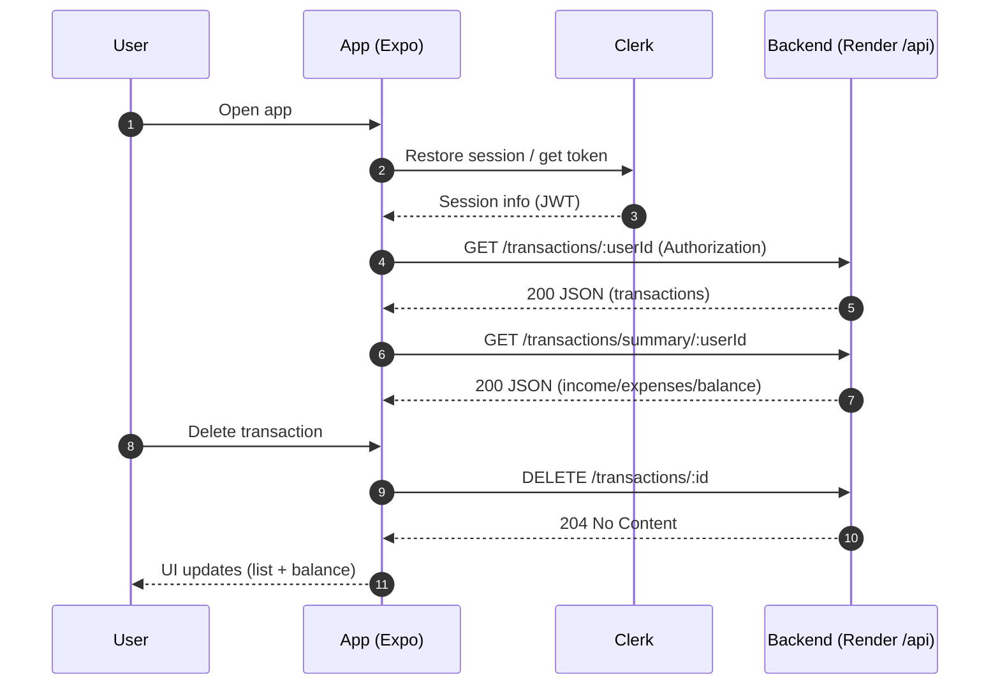

# Expense Tracker – Mobile (Expo)

This is the mobile frontend for the Expense Tracker built with Expo, React Native, and expo-router. It authenticates users with Clerk, fetches data from the Express backend (deployed on Render), and provides a clean UI for viewing balances, listing transactions, adding new entries, and deleting items.

## Overview

- UI built with Expo SDK 54 + React Native 0.81 and expo-router 6 (file‑based routing).
- Authentication handled by `@clerk/clerk-expo`.
- Data fetched from the backend API hosted on Render at `/api`.
- Core features: view total balance, list recent transactions, create a transaction, delete a transaction, and view summary totals.

### Tech stack

- Expo (54), React Native (0.81), React 19
- expo-router, React Navigation
- Clerk Expo SDK (`@clerk/clerk-expo`)
- Reanimated, Gesture Handler, Safe Area Context, Screens

### Key directories

- `app/(auth)/sign-in.tsx`, `app/(auth)/sign-up.tsx`: Authentication screens
- `app/(root)/index.tsx`: Home screen (list, balance)
- `app/(root)/create.tsx`: Create transaction screen
- `constants/api.ts`: API base URL and normalization
- `hooks/useTransactions.ts`: Fetch transactions, summary; delete transaction
- `components/`: UI building blocks (balance card, transaction item, etc.)

## Environment

Set the following public env vars (read at build/runtime by the app):

```env
EXPO_PUBLIC_API_URL=https://wallet-api-yfnt.onrender.com/api
EXPO_PUBLIC_CLERK_PUBLISHABLE_KEY=pk_test_XXXXXXXXXXXXXXXXXXXXXXXXXXXX
```

Notes:

- The app normalizes the API base to end with `/api` (guards against accidental `/api/health` or trailing slashes).
- The frontend is designed to hit the cloud backend (Render) by default.

## Frontend Flow (Sequence)



## Navigation Flow

```mermaid
flowchart TD
   A[App start] --> B{Signed in?}
   B -- No --> C[(Auth Stack)]
   C --> C1[Sign In]
   C --> C2[Sign Up]
   B -- Yes --> D[(Root Stack)]
   D --> D1[Home (index.tsx)]
   D --> D2[Create (create.tsx)]
```

## API Endpoints Used

- `GET /api/transactions/:userId` → list user transactions
- `GET /api/transactions/summary/:userId` → totals and balance
- `DELETE /api/transactions/:id` → remove a transaction
- `GET /api/health` → backend health (used for diagnostics only)

See `hooks/useTransactions.ts` for the request logic and `constants/api.ts` for base URL handling.

## Run & Build

Install dependencies and start the app:

```bash
npm install
npx expo start
```

Useful options in the Expo CLI output:

- Development build
- Android emulator
- iOS simulator
- Expo Go

Health checks and builds:

```bash
# Project checks
npx expo-doctor

# EAS Android preview build (from moblie/)
eas build -p android --profile preview
```

## Troubleshooting

- JSON parse error (Unexpected token '<') usually means the request hit an HTML page (e.g., wrong base URL). Verify `EXPO_PUBLIC_API_URL` ends with `/api`.
- 404 on `/api/health/transactions/...` means the base mistakenly includes `/health`. The app normalizes this, but also confirm your env var.
- CORS errors in web: backend must allow your origin; ensure Render deployment includes the updated CORS config.

---

This app uses [file-based routing](https://docs.expo.dev/router/introduction). You can start developing by editing files inside the `app` directory.

For more about Expo:

- [Expo documentation](https://docs.expo.dev/)
- [Learn Expo tutorial](https://docs.expo.dev/tutorial/introduction/)
